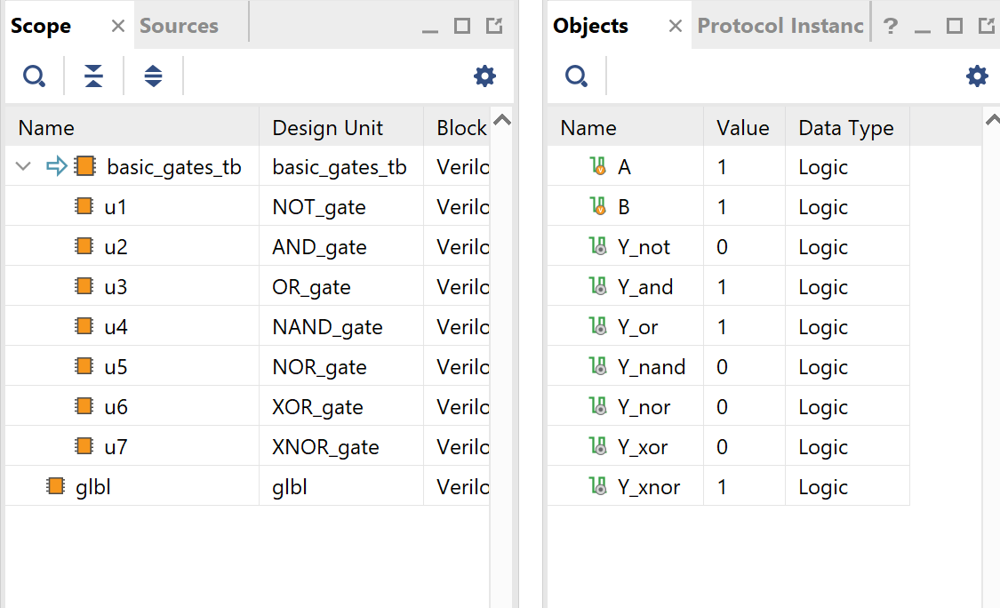
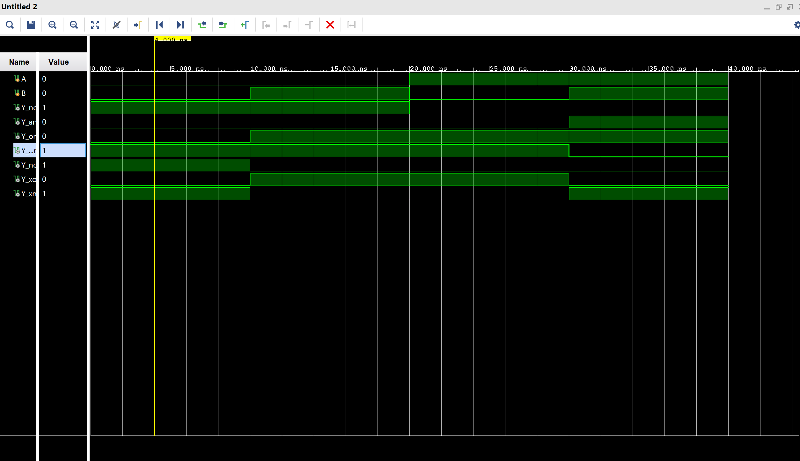
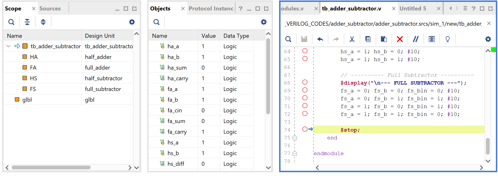
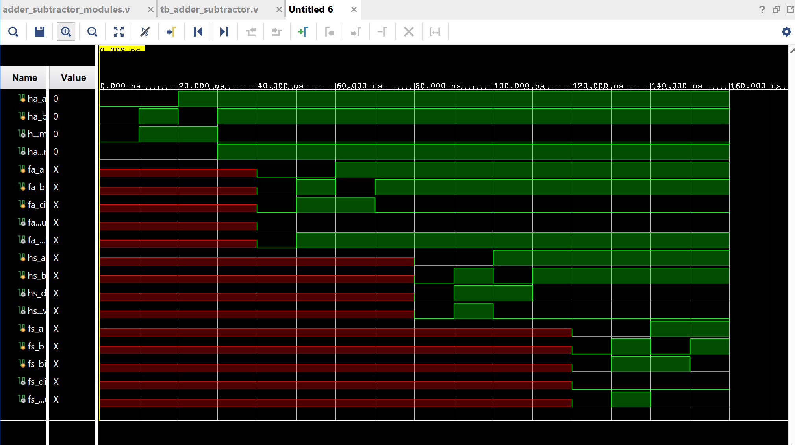
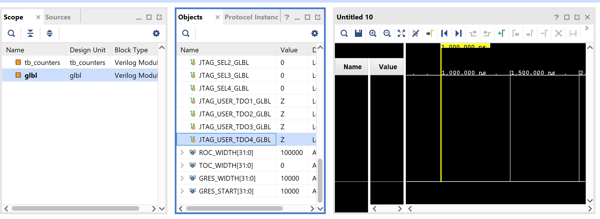

# Verilog Practical Report – README

This document contains summaries of all Verilog practicals  

---

## 1. Basic Gates

### Theory
Basic logic gates such as AND, OR, NOT, NAND, NOR, XOR, and XNOR perform fundamental Boolean operations. These are the foundation for all combinational and sequential digital circuits.

### Vivado Dashboard

### Waveform

---

## 2. Multiplexers (2x1 & 4x1)

### Theory
A multiplexer (MUX) selects a single output from multiple inputs using select lines.  
- A **2x1 MUX** chooses between two inputs using one select line.  
- A **4x1 MUX** selects one of four inputs using two select lines.  
MUXes are widely used for data routing and control operations.

### Waveform

---

## 3. Priority Encoder and Decoder

### Theory
A **priority encoder** outputs the binary value of the highest-priority active input.  
A **decoder** converts a binary input into a one-hot output.  
These components are essential for communication systems, interrupt handling, and address decoding.

### Vivado Dashboard

### Waveform

---

## 4. Half and Full – Adder & Subtractor

### Theory
Arithmetic operations begin with half and full adders/subtractors:  
- **Half Adder/Subtractor** operate on two bits.  
- **Full Adder/Subtractor** include carry/borrow handling for multi-bit arithmetic.  
These circuits are core components of ALUs and digital processing systems.

### Vivado Dashboard

### Waveform

---

## 5. Universal Adder and Subtractor

### Theory
A universal adder–subtractor performs both addition and subtraction using a mode control input. Subtraction is implemented using the 2’s complement method, enabling efficient arithmetic inside processors and ALUs.

### Vivado Dashboard

### Waveform

---

## 6. SR Latch and SR Flip-Flop

### Theory
An **SR latch** is a level-sensitive bistable device used for simple memory storage.  
The **SR flip-flop** is an edge-triggered version, storing data only on a clock transition.  
Both are fundamental sequential elements.

### Vivado Dashboard

### Waveform

---

## 7. D and JK Flip-Flop

### Theory
A **D flip-flop** stores the input value on every clock edge.  
A **JK flip-flop** extends functionality with set, reset, toggle, and hold states.  
These are widely used in counters, registers, and sequential logic design.

### Vivado Dashboard

### Waveform

---

## 8. Counter

### Theory
Counters increment or decrement their state on each clock pulse.  
They can be synchronous or asynchronous and are used in timers, event counters, digital clocks, and state machines.

### Vivado Dashboard

---

## Thank You
Submitted By: Tejaswi Anand (CSE:A)

---
